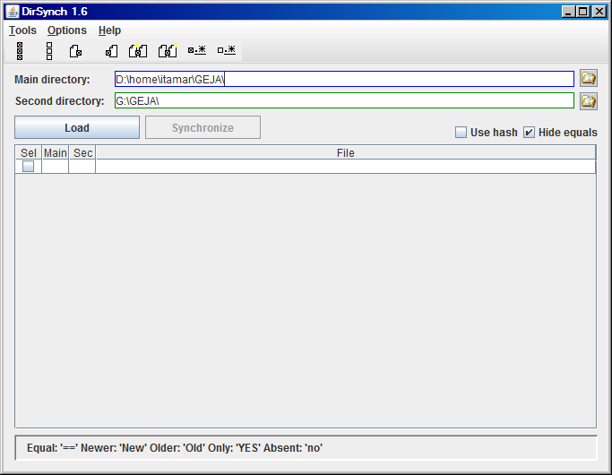

#  DirSynch

DirSynch is a bidirectional directory synchronizing software. It helps you to discover the status of each file in both directories:
if it's only in one of them, if it's newer in one than in the other, or if they are simply equal. It also support file content 
comparison using a hash function, although it's very time consuming. After letting you to choose which files do you want to synchronize, 
it performs the right operations to make both directories equal (or not, if you want it different). The program can create a backup of 
the files before overwriting them.

You can see instructions of use and the history of the project in the [help file](www/DirSynch-help.html).

This software was originally hosted in [SourceForge](https://sourceforge.net/projects/dirsynch/).
For now, you can download the current release from there. The next releases will be published in GitHub.
